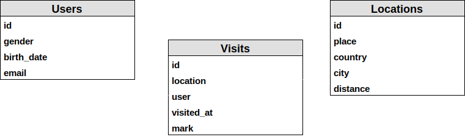
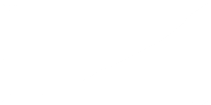
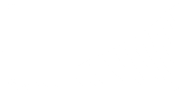
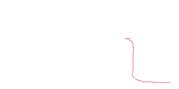
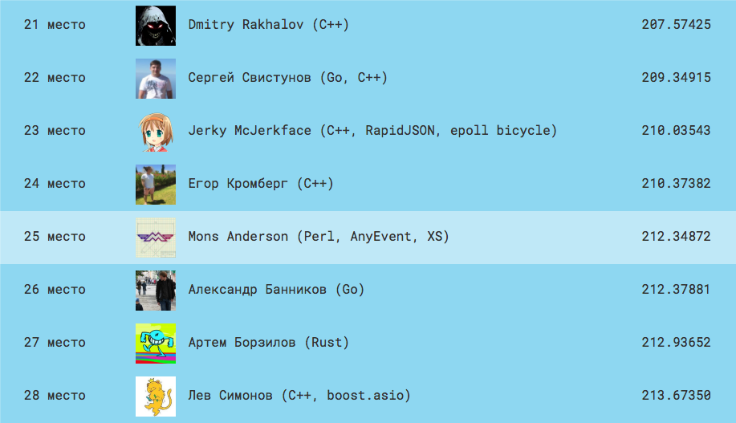
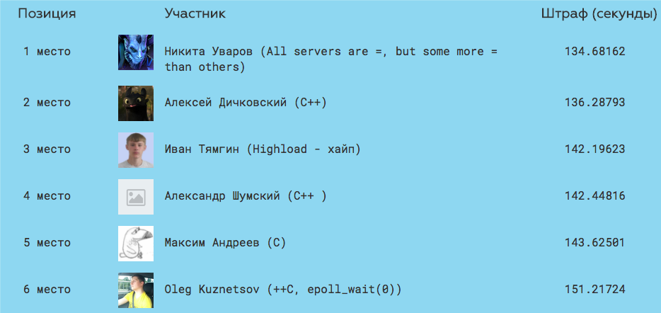

class:start

.narrow[

.raptor-num[

]

# YAPC::Russia 2017
## В топ Highload Cup на Perl

]


#### Mons Anderson &lt;<mons@cpan.org>&gt;

.it-mail-ru[

.text[IT.MAIL.RU]
]
.mail-ru[

]
.hotbox[

]

.msk[

]

---

class: center, middle, normal


### Соревнование разработчиков<br>высоконагруженных систем

---

# А что нужно делать?
- Создай автономное отзывчивое серверное приложение
- Собери его в docker-контейнер и залей в хранилище
- Обстреляй приложение на выданных боевых данных
- Стань самым крутым разработчиком нагруженных систем и получи приз

---

# Три вида сущностей

- User (Путешественник)
- Location (Достопримечательность)
- Visit (Посещения)

---

# Схема



---

# Пять типов методов

1. GET /:entity/:id
1. GET /users/:id/visits?{params}
1. GET /locations/:id/avg?{params}
1. POST /:entity/:id
1. POST /:entity/new

--

.center[
# 2000 RPS
]

### Intel Xeon (4 x 2 GHz), 4GB RAM .

---

class: tall-image, center, middle

.center[

]


---

1. GET /users/:id
1. GET /locations/:id
1. GET /visits/:id
1. POST /users/:id
1. POST /locations/:id
1. POST /visits/:id
1. POST /users/new
1. POST /locations/new
1. POST /visits/new
1. GET /users/:id/visits?{params}
1. GET /locations/:id/avg?{params}

---

# Инструменты

- EV
- JSON::XS
- AnyEvent::HTTP::Server (II)
- Time::Moment

---

# Прототип за вечер

- Одно ядро
- Данные в памяти
```perl
our %USERS;
our %LOCATIONS;
our %VISITS;
our %USER_VISITS;
our %LOCATION_VISITS;
our %COUNTRIES; our %COUNTRY_ID;
```

---

1. GET /users/:id
1. GET /locations/:id
1. GET /visits/:id
1. POST /users/:id
1. POST /locations/:id
1. .red[POST /visits/:id]
1. POST /users/new
1. POST /locations/new
1. .red[POST /visits/new]
1. .red[GET /users/:id/visits?{params}]
1. .red[GET /locations/:id/avg?{params}]

---

# Time::Moment

```perl
my $now = Time::Moment->now;
...
my $older = $now
    ->minus_years( $prm->{fromAge} )
    ->epoch;
push @cond, "\$_->{user}{birth_date} <= $older";

my $younger = $now
    ->minus_years( $prm->{toAge} )
    ->epoch;
push @cond, "\$_->{user}{birth_date} > $younger";
...
my $body = 'sub {' . join(' and ', @cond) . '}';
$filter = eval $body or die $@;
```

---

# Первый обстрел

- Фаза обстрела # 1 (GET): .red[32%] PASS
- Фаза обстрела # 2 (POST): 100% PASS
- Фаза обстрела # 3 (GET): .red[34%] PASS

.left[
```json
{
  "city": "Роттерламск",
  "id": "125",
  "distance": 42,
  "country": "Палау",
  "place": "Двор"
}
```
]
.right[
```json
{
  "city": "Роттерламск",
  "id": 125,
  "distance": 42,
  "country": "Палау",
  "place": "Двор"
}
```
]

---

# Первый обстрел

- Фаза обстрела # 1 (GET): .red[32%] PASS
- Фаза обстрела # 2 (POST): 100% PASS
- Фаза обстрела # 3 (GET): .red[34%] PASS

.left[
```json
{
  "city": "Роттерламск",
* "id": "125",
  "distance": 42,
  "country": "Палау",
  "place": "Двор"
}
```
]
.right[
```json
{
  "city": "Роттерламск",
* "id": 125,
  "distance": 42,
  "country": "Палау",
  "place": "Двор"
}
```
]

---
class: tall-image

# JSON::XS

.center[]


---

# Костылики (0+)

```perl
    id           => 0+$user->{id},
    birth_date   => 0+$user->{birth_date},

        mark       => 0+$_->{visit}{mark},
        visited_at => 0+$_->{visit}{visited_at},

    id       => 0+$loc->{id},
    distance => 0+$loc->{distance},

id          => 0+$visit->{id},
location    => 0+$visit->{location},
user        => 0+$visit->{user},
visited_at  => 0+$visit->{visited_at},
mark        => 0+$visit->{mark},
```

---

class:center middle

# 100% PASS

---

# Немного про оценку

### Профиль нагрузки
* 180 сек, 1 → 200 RPS (GET). 18090 req
* 120 сек, 100 RPS (POST). 12000 req
* 120 сек, 200 → 2000 RPS (GET). 132000 req

--



--

### Оценка
* Считается время ответа
* Штраф равен таймауту: 2 секунды



---
# Запуск рейтингового

--

.center.red[
#119848.439812
]

--

.center.h450px[

]

---

# Результаты

1. GET → 200 RPS - 100%
1. POST 100RPS - 100%
1. GET → 2000 RPS - .red[62%]

--

.red.center[
#960 RPS
]



---

# Будем лечить

.sidepic[

]

- .red[`- AnyEvent::HTTP::Server`]
- .green[`+ AnyEvent::Socket`]
  + .green[`+ tcp_server`]
- .green[`+ Router::R3`]

---

```perl
use AnyEvent::Socket;

tcp_server 0, $port, sub {
    my $fh = shift;
    setsockopt($fh, SOL_SOCKET, SO_LINGER, 0);
    ...
}, sub {
    my $fh = shift;
    setsockopt($fh, IPPROTO_TCP, TCP_NODELAY, 1)
        or warn "setsockopt TCP_NODELAY: $!";

    setsockopt($fh, IPPROTO_TCP, TCP_QUICKACK, 1)
        or warn "setsockopt TCP_QUICKACK: $!";

    setsockopt($fh, IPPROTO_TCP, TCP_LINGER2, 0)
        or warn "setsockopt TCP_LINGER2: $!";

    1024 # backlog
};
```

---

```perl
use Router::R3;

my $GET = Router::R3->new(
    '/users/{id:\d+}'            => \&get_user,
    '/visits/{id:\d+}'           => \&get_visit,
    '/locations/{id:\d+}'        => \&get_location,
    '/users/{id:\d+}/visits'     => \&get_user_visits,
    '/locations/{id:\d+}/avg'    => \&get_location_avg,
    '/locations/{id:\d+}/visits' => \&get_loc_visits,
);
my $POST = Router::R3->new(
    '/users/new'                 => \&create_user,
    '/locations/new'             => \&create_location,
    '/visits/new'                => \&create_visit,
    '/users/{id:\d+}'            => \&update_user,
    '/locations/{id:\d+}'        => \&update_location,
    '/visits/{id:\d+}'           => \&update_visit,
);

```

---

# Метод для возврата ответа

```perl
my $reply = sub {
    my ($st,$b) = @_;
    syswrite($fh,
        "HTTP/1.1 $st XXX\015\012".
        "Server: UsePerlOrDie/1.0\015\012".
        "Connection: close\015\012".
        "Content-Length: ".length($b).
        "\015\012\015\012".$b
    );
    close $fh;
};
```
--
.red.center[
# Никогда так не делайте в prod'е
]
--
.red.center[
(нет проверок, нет io на write)
]

---
```perl
$rw = AE::io $fh, 0, sub {
   my $r = sysread($fh, $rbuf, 256*1024, length $rbuf);
   if ($r) {
      ($met,$path_query) = $rbuf =~
      m{^([^ ]+)\s+([^ ]+)\s+[^\012]*\012}gc or return;
      ($path,$qr) = split '\?', $path_query, 2;
      if ($met eq 'GET') {
          my ($m,$cap) = $GET->match($path)
          or return $reply->(404, '{}');
          my $query = decode_query($qr);
          ...
      }
      elsif ($met eq 'POST') {
          my ($m,$cap) = $POST->match($path);
          my ($cl) = $rbuf =~
              /Content-Length:\s*(\d+)/gci or return;
          my $end = index($rbuf,"\015\012\015\012",
              pos $rbuf);
          $d = $JSON->decode(substr($rbuf,$end,$cl));
          ...
      }
```

---

```perl
    ...
    elsif (defined $r) {
        $reply->(400, "{}");
    }
    elsif ($! == Errno::EAGAIN) {
        return;
    }
    else {
        undef $rw;
        close $fh;
        return;
    }
};
```

---

.center.red[
# 150.940976!
]

- 36 неверных ответов в фазе POST (.red[+72])
- можно уменьшить время до 80

---

# Nonblocking logging

```perl
pipe my $logr,my $logw or die "pipe: $!";

if (fork) {
    close $logr;
    AnyEvent::Util::fh_nonblocking($logw,1);
    $SIG{__WARN__} = sub {
        my $now = Time::Moment->now;
        syswrite $logw, sprintf("[%s] %s",
            $now->strftime("%H:%M:%S%3f"),@_);
    };
}
else {
    close $logw;
    while (<$logr>) { print STDERR $_; }
    exit;
}
```

---

# Бывает POST без body

```perl
if( ($cl) = $rbuf =~ /Content-Length:\s*(\d+)/gci ) {
    $rbuf =~ m{\015\012\015\012}gc or return;
}
elsif ($rbuf =~ m{\015\012\015\012}gc) {
    return $reply->(400, '{"error":"empty post"}');
}

```

---

# Low-latency POST: aefor

```perl
for ( 0..$#$old ) {
    if ( $old->[$_]{visit}{id} == $vis->{id} ) {
        $ptr = splice @$old, $_,1, ();
        last;
    }
}
```

--

```perl
aefor 0, $#$old, sub {
    if ( $old->[$_]{visit}{id} == $vis->{id} ) {
        $ptr = splice @$old, $_,1, ();
        last;
    }
}, sub {
    # end of loop
}
```

---
class:big-code

```perl
sub aefor($$$$;$) {
    my ($fin,$cb,$from,$to,$steps) = (pop,pop, @_);
    $steps //= 50;

    if ($to >= $from) {
        ...
        $step->(); # `$x .. $x + $steps`

    } else {
        local $_ = $from;
        &$fin;
    }
}
```

---
class:big-code

```perl
    ...
        my $step;$step = sub {
            my $iter_end = min($i+$steps, $to);
            local $_ = $i;
            while () { &$cb; }
            continue {
                $_++;
                if ($_ > $iter_end) {
                    last if $_ > $to;
                    $i = $_;
                    &AE::postpone($step); return;
                }
            }
            undef $step; &$fin;
        };
    ...
```

---
class:big-code

```perl
    ...
        my $step;$step = sub {
            my $iter_end = min($i+$steps, $to);
*           local $_ = $i;
            while () { &$cb; }
            continue {
                $_++;
                if ($_ > $iter_end) {
                    last if $_ > $to;
                    $i = $_;
                    &AE::postpone($step); return;
                }
            }
            undef $step; &$fin;
        };
    ...
```
---
class:big-code

```perl
    ...
        my $step;$step = sub {
            my $iter_end = min($i+$steps, $to);
            local $_ = $i;
            `while` () { `&$cb;` } # support next/last
            continue {
                $_++;
                if ($_ > $iter_end) {
                    last if $_ > $to;
                    $i = $_;
                    &AE::postpone($step); return;
                }
            }
            undef $step; &$fin;
        };
    ...
```
---
class:big-code

```perl
    ...
        my $step;$step = sub {
            my $iter_end = min($i+$steps, $to);
            local $_ = $i;
            while () { &$cb; }
            `continue` { # next jumps here
                $_++;
                if ($_ > $iter_end) {
                    last if $_ > $to;
                    $i = $_;
                    &AE::postpone($step); return;
                }
            }
            undef $step; &$fin;
        };
    ...
```
---
class:big-code

```perl
    ...
        my $step;$step = sub {
            my $iter_end = min($i+$steps, $to);
            local $_ = $i;
            while () { &$cb; }
            continue {
                $_++;
                if ($_ > $iter_end) {
                    last if $_ > $to;
                    `$i = $_`;
                    &`AE::postpone`($step); return;
                }  # yield to event loop
            }
            undef $step; &$fin;
        };
    ...
```
---
class:big-code

```perl
    ...
        my $step;$step = sub {
            my $iter_end = min($i+$steps, $to);
            local $_ = $i;
            while () { &$cb; }
            continue {
                $_++;
                if ($_ > $iter_end) {
                    last if $_ > $to;
                    $i = $_;
                    &AE::postpone($step); `return`;
                }
            }
            undef $step; `&$fin`;
        };
    ...
```

---
class: pre-no-margin
```perl
sub aefor($$$$;$) {
    my ($fin,$cb,$from,$to,$steps) = (pop,pop, @_);
    if ($to >= $from) {              $steps //= 50;
        my $i = $from;
        my $step;$step = sub {
            my $iter_end = min($i+$steps, $to);
            local $_ = $i;
            while () { &$cb; }
            continue {
                $_++;
                if ($_ > $iter_end) {
                    last if $_ > $to;
                    $i = $_;
                    &AE::postpone($step); return;
                }
            }
            undef $step; &$fin;
        };$step->();
    } else { local $_ = $from; &$fin; }
}
```

---
class: center, middle

.center.red[
# 81.809672
# 100%
]

--
.center.red[
# 80.586385!
]

---

# Fcking docker

```
id="989d8c47d0c8": Pull complete
id="e7fb81b6af20": Extracting
id="94b6b60b6f76": Download complete
...
Ошибка при выполнении docker-compose up...
Pulling client_8324 (travels/rabbit_climber:latest)...
```

.sidepic[

]

---

# URI::XSEscape

uid 1326596177

.center[]

---

# Docker ;(

```
id="53af9fd773ea": Download complete
error: failed to register layer:
    ApplyLayer exit status 1 stdout: stderr:
    Container ID `1326596177` cannot be mapped to a host ID
```

--

```Dockerfile
RUN /usr/local/bin/cpanm -n \
    JSON::XS EV AnyEvent \
    Time::Moment URI::XSEscape \
*   && rm -rf /root/.cpanm
```

---

# Тем временем

>Друзья, мы стартанули с увеличенными данными и плотностью RPS обстрела.
>Именно такой объем данных и RPS будут в финале.

--

Профиль нагрузки

* 300 сек, 1 → 1000 RPS (GET). 150150 req
* 250 сек, 50 → 270 RPS (POST). 40000 req
* 120 сек, 500 → 10000 RPS (GET). 630000 req

--

.red[
# Данных в 10 раз больше, RPS в 5 раз
]

---
class: tall-image, center, middle

.center[

]


---
class: big-code

# XS✝✝

```C
typedef struct HLCup {
    std::map<int,User *>     *users;
    std::map<int,Location *> *locations;
    std::map<int,Visit *>    *visits;
    ...
} HLCup;

void new(SV *)
PPCODE:
    HLCup * self = (HLCup *) safemalloc(sizeof(HLCup));
    self->users = new std::map<int,User*>;
    ...
```

---
class: big-code
# "Быстрый" JSON

```C
 mycpy(p,"{\"id\":");
 p += snprintf(p, 14, "%d", user->id);
 mycpy(p,",\"birth_date\":");
 p += snprintf(p, 14, "%d", user->birth_date);
 mycpy(p,",\"gender\":\"");
 *p++ = user->gender;
 mycpy(p,"\",\"email\":\"");
 memcpy( p, SvPVX(user->email),SvCUR(user->email) );
 p+=SvCUR(user->email);
 ...
```

---

# Новый заход

--

## Gentoo (-march=sandybridge -O2)

--

## stableperl (fast hash)

--

.center.green[3.2 Gb RAM]
--

.center[5600 RPS]
--
.center[...]
--
.red.center[
# 260102.016396
]
--

.red.center[4k RPS]

---

# HTTP::Parser::XS

### локально
* 9800 RPS и 100% PASS

--

### запуск
* .red[7500 RPS]
* 15109 ошибок на POST
* 46% на GET2 (338281 ошибок)
* .red[739491.365476]

---

# decode_query

```perl
use URI::XSEscape 'uri_unescape';

sub decode_query {
    my %rv;
    return \%rv unless length $_[0];
    for (split '&', $_[0]) {
        my ($k,$v) = split '=', $_, 2;
        $k = uri_unescape($k =~ s/\+/ /sr);
        $v = uri_unescape($v =~ s/\+/ /sr);
        utf8::decode $k;
        utf8::decode $v;
        $rv{ $k } = $v;
    }
    return \%rv;
}
```

---
class: low-padding

# Чуть-чуть XS

```c
do {
   char *nxt = strchr(p,'&'); if (!nxt) nxt = e;
   char *eq = strchr(p,'=');
   if (!eq || eq > nxt) { hv_store(rv,p,nxt-p,&PL_sv_undef,0); }
   else {
      SV *v = newSV(nxt-eq+2);
      SvUPGRADE(v, SVt_PV);SvPOKp_on(v);SvUTF8_on(v);
      char *pv = SvPVX(v); char *dp = eq+1;
      while (dp < nxt) {
         if (*dp == '%' && dp+2 < nxt && isxdigit(dp[1]) && isxdigit(dp[2]) )
            *pv++ = tbl[dp[1]]<<4 | tbl[dp[2]]; dp += 3;
         else if(*dp == '+') { *pv++ = ' '; dp++; }
         else                { *pv++ = *dp++; }
      }
      *pv = 0; SvCUR_set(v, pv - SvPVX(v));
      hv_store(rv,p,eq-p,v,0);
   }  p = nxt+1;
} while (p < e);

```

???

```
ST(0) = sv_2mortal(newRV_noinc((SV *)rv));
STRLEN len;
char *p = SvPVbyte(src, len); char *e = p+len;
char *nxt;

```

---

# Pure Perl слишком медленный

.float-right[

]

--

```perl
use EV::HTTP::Server;
```

--

```perl
# TODO since 2015
```

--

```perl
# Started development
```

---
class:big-code
# Local::HTTPServer

```c
#include <sys/socket.h>
#include <netinet/tcp.h>

#include "EVAPI.h"
#include "picohttpparser.h"
```

.center.red[
# 60k RPS
]

--

.center.red[
340!
]
.center.green[
100% PASS
]
.center[
48 место в рейтинге
]

---

# Можно отдохнуть

--

.sidepic[

]

---

# Можно отдохнуть

.sidepic[

]

.red[
# PHP?
]
--
.red[
# на 35м месте
]
--
.red[
# со счётом ~280
]
 
---
class: low-padding

```c
if (memcmp(p,"/users/",7) == 0) { p += 7;
    int id = 0;
    do {
        if (int_tb[*p] > -1) { id = id*10 + int_tb[*p]; }
        else if (*p == '/') { break; }
        else if (is_post && memcmp(p,"new",3) == 0 && id == 0 && p+3 == e)
            return 1; /* POST /users/new */
        else return -1;
        p++;
    } while (p < e);
    *p_id = id;
    if (p < e) {
        if (memcmp(p,"/visits",7) == 0 && p+7 == e && !is_post)
            return 2; // GET /users/:id/visits
        else return -1;
    }
    else {
        if (likely(!is_post))
            return 3; // GET /users/:id
        else
            return 4; // POST /users/:id
    }
}

```

---

# Perl: connecting XS

```perl
my $server = Local::HTTPServer->new("0.0.0.0",$port, [
    sub { return 501,"Fuck off"; },
    \&create_user,
*   \&Local::HLCup::get_user_visits_rv,
*   \&Local::HLCup::get_user_rv,
    \&update_user,

    \&create_location,
    \&get_location_avg,
    \&get_location_visits,
*   \&Local::HLCup::get_location_rv,
    \&update_location,

    \&create_visit,
*   \&Local::HLCup::get_visit_rv,
    \&update_visit,
]);
```

---

# Дедлайн

### локально
* 30k RPS и 100% PASS

--

### запуск
* .green[100% PASS]
* .green[243.770117]
* 42 место

---
class: tall-image

# Pre-final рейтинг

.center[

]

---
class: tall-image

# Pre-final рейтинг

.center[

]

---
class: center, middle

# Perl : C++
# 1.5 : 1

---
class: tall-image, center, middle

.center[

]

[github.com/Mons/hlcup](https://github.com/Mons/hlcup)<br/>
[github.com/sat2707/hlcupdocs](https://github.com/sat2707/hlcupdocs)

---

class:start

.narrow[

.raptor-num[

]

# Вопросы?

]


#### Mons Anderson &lt;<mons@cpan.org>&gt;

.it-mail-ru[

.text[IT.MAIL.RU]
]
.mail-ru[

]
.hotbox[

]

.msk[

]

---

class:start

.narrow[

.raptor-num[

]
# We're hiring!

* Perl 5: AnyEvent, XS, Coro
* Lua, LuaJIT, Tarantool
* Real highload!
* Incredible experience
]


#### Mons Anderson &lt;<mons@cpan.org>&gt;

.it-mail-ru[

.text[IT.MAIL.RU]
]
.mail-ru[

]
.hotbox[

]

.msk[

]
